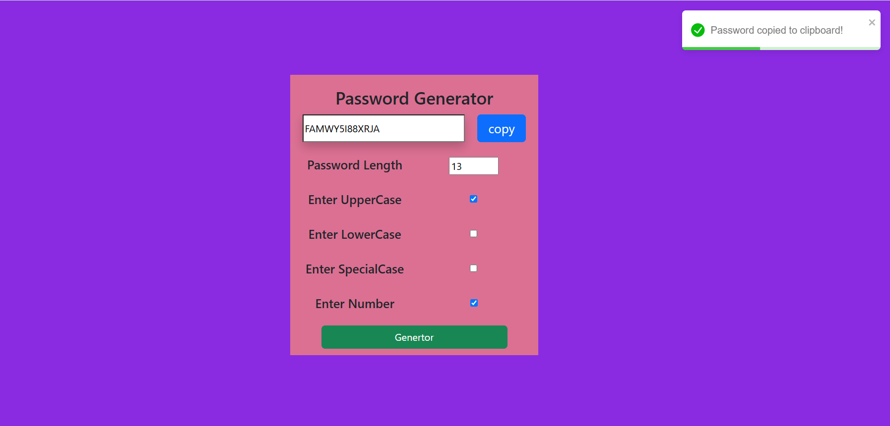

# 🔐 Password Generator

<<<<<<< HEAD
A user-friendly and customizable **Password Generator** built with React.

## 🌟 Features

- Generate secure, random passwords
- Choose password length
- Include/exclude:
  - ✅ Uppercase letters
  - ✅ Lowercase letters
  - ✅ Numbers
  - ✅ Special characters
- Copy password to clipboard
- Responsive UI with React Bootstrap
- Notifications using `react-toastify`

## 🚀 Technologies Used

- React.js
- Bootstrap & React-Bootstrap
- React-Toastify
- GitHub Pages (for deployment)

## 📸 Screenshot

 <!-- Optional image -->

## 🔧 Installation

```bash
git clone https://github.com/SaiYadav1818/Password-Genarator.git
cd Password-Genarator
npm install
npm start
=======
A modern and responsive **Password Generator** built using React. Generate strong, customizable passwords instantly with the click of a button.

---

## 🚀 Features

- ✅ Generate strong, secure passwords
- ✅ Choose password length
- ✅ Include/exclude:
  - Uppercase letters
  - Lowercase letters
  - Numbers
  - Special characters
- ✅ Copy password to clipboard
- ✅ Toast notification on copy (using `react-toastify`)
- ✅ Responsive UI (built with `react-bootstrap`)

---

## 🧰 Tech Stack

- ⚛️ React.js (with Create React App)
- 💅 Bootstrap & React-Bootstrap
- 🔔 React-Toastify
- 🚀 Deployed on GitHub Pages

---

## 📸 Screenshot


> Replace with the correct path if your image is elsewhere

---

## 🛠️ Setup Instructions

1. **Clone the repo**
   ```bash
   git clone https://github.com/SaiYadav1818/Password-Genarator.git
   cd Password-Genarator

>>>>>>> 46f474674720594c37238187e60618dcb7acc9c0
